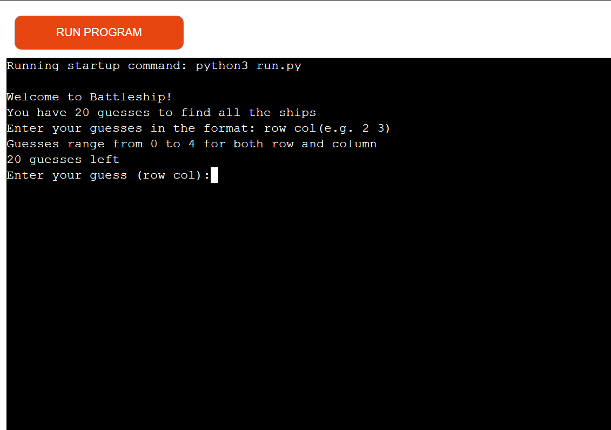
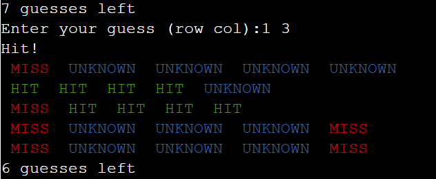
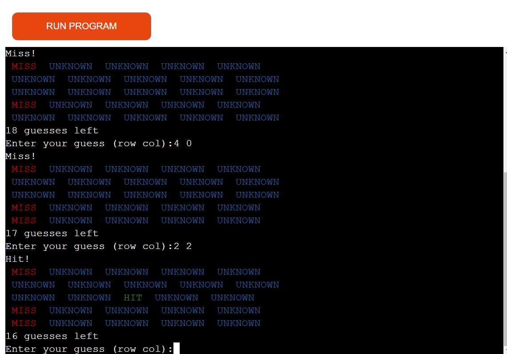
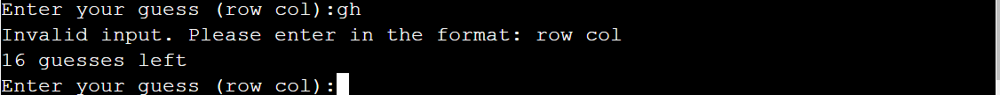
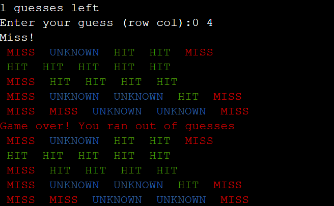

# Battleship Game

Battleship is a classic guessing game where a player tries to sink all the computer's ships. This version is implemented in Python and can be played in the console. Unlike classic Battleship you only have 20 tries to sink the computer's fleet or you loose!

## Features

### Existing Features

- Game Introduction
    - Brief message to explain how the game works and the format required to guess where a ship is.

- Random Ship Placement
    - Ships are placed randomly on the computer's board. They can be placed both horizontally or vertically and they cannot overlap. All ships fit within the board's boundries.

- Player Guesses
    - The player has 20 guesses to sink the computer's fleet of ships. Each guess provides feedback on if it was a hit or miss. The guess board is shown after each guess and the player is shown their remaining guesses.

     
     
- Coloured Game Board
    - The game board uses colours to make this text based game more visually appealing. Green for hit, red for a miss. At the end of the game the winning message is displayed in green and the game over message in red.

      

- Input Validation
    - Extensive validation for player input. All guesses must be in the correct format and within the game board. It also prevents guessing the same cell more than once and the guess count does not change unless a guess is entered correctly. If a user enters an invalid guess they will receive a message asking them to try again and reminding them of the correct format.

      

- End of Game Message
    - The game tracks a player's total guesses. Once you reach 20 completed guesses a message will appear to let you know that you lost. If you manage to sink all ships before you run out of guesses a winning message will appear instead. The final game board is shown.

    
    
### Features Left to Implement
 - Difficulty Levels
    -  Add multiple difficulty levels (e.g. Easy, Medium, Hard) with different numbers of ships, different board sizes and different number of guesses allowed.

 - High Score System
    - Track how many guesses it takes a player to sink all ships and add a leaderboard.

 - Player vs Computer
    - Add a player board and allow you to play against the computer and see if you can sink all their ships before it sinks yours.

## Game planning
- Game was planned out to follow the below steps. Logic was then added to meet these requirments:
      - Initalise Game
      - Randomly place ships horizontally and vertically. Within game board and with no overlapping
      - Display game Instructions
      - Loop until player sinks all ships or runs out of guesses
            - Get player guess
            - Valididate input
            - Check if hit or miss
            - Prevent the same guess as counting twice
            - Update board and guess counter
            - Display updated guess board
      - Display end of game message

## Libraries Used
- Colorama library was used for this projet.
      - It enhanced the user experience by making the game more visually appealing.
      - It helps provide visual feedback letting a player distinguish between hits, misses and unknow cells.
      - Examples of Colorama in use are in the screenshots above
       
## Testing
  -  The Battleship game was thoroughly tested to ensure all features work as expected and do not contain any bugs. 
  - The code was passed through a linter i.e. flake8 on vs code and no errors were found. Screenshot included below.

## Manual Testing

<table>
  <tr>
        <th>Action</th>
        <th>Expected Behaviour</th>
        <th>Pass or Fail</th>
        <th>Notes</th>
  </tr>
    <tr>
        <td>Launch Game on Heroku</td>
        <td>Game loads with instructions and remainin guesses. Input shown for player guess</td>
        <td>Pass</td>
        <td></td>
  </tr>
      <tr>
        <td>Restart game by clicking run programme on Heroku</td>
        <td>Game board is reset, ships get new random location and guesses reset</td>
        <td>Pass</td>
        <td></td>
  </tr>
    <tr>
        <td>Check for random placement of ships</td>
        <td>Ships appear randomly both horizontally and vertically</td>
        <td>Pass</td>
        <td>Played game repeatedly and got different layouts each time</td>
  </tr>
  <tr>
        <td>Enter valid guess</td>
        <td>Game accepts the guess and marks hit or miss</td>
        <td>Pass</td>
        <td>Tested with input "1 2"</td>
  </tr>
    <tr>
        <td>Enter guess with no space between row and column</td>
        <td>Game rejects the guess and prompts for valid input. Guess counter does not change</td>
        <td>Pass</td>
        <td>Tested with input "33"</td>
  </tr>
  <tr>
        <td>Enter invlaid numerical guess</td>
        <td>Game rejects the guess and prompts for valid input. Guess counter does not change</td>
        <td>Pass</td>
        <td>Tested with input "6 0"</td>
  </tr>
  <tr>
        <td>Enter guess with a leading 0</td>
        <td>Game rejects the guess and prompts for valid input. Guess counter does not change</td>
        <td>Pass</td>
        <td>Tested with 6 00</td>
  </tr>
  <tr>
        <td>Enter letters instead of valid guess</td>
        <td>Game rejects the guess and prompts for valid input. Guess counter does not change</td>
        <td>Pass</td>
        <td>Tested with a g</td>
  </tr>
  <tr>
        <td>Repeat a guess on the same cell</td>
        <td>Game indicates that the cell has already been guessed. Guess counter does not change</td>
        <td>Pass</td>
        <td>Tested with 3 3, worked corectly first guess and notified that it was already guessed on second attempt</td>
  </tr>
  <tr>
        <td>Hit a ship</td>
        <td>Game board changes to mark where your hit registered. Guess counter updates</td>
        <td>Pass</td>
        <td></td>
  </tr>
    <tr>
        <td>Miss a ship</td>
        <td>Game board changes to mark where your shot missed. Guess counter updates</td>
        <td>Pass</td>
        <td></td>
  </tr>
  <tr>
        <td>Win the game by sinking all ships</td>
        <td>Game displays a winning message</td>
        <td>Pass</td>
        <td></td>
  </tr>
  <tr>
        <td>Lose the game by using all guesses</td>
        <td>Game displays a game over message</td>
        <td>Pass</td>
        <td>Tested my making 20 guesses and not hitting all 14 ship cells</td>
  </tr>
  <tr>
        <td>Verify color coding of hits</td>
        <td>Hits are displayed in green</td>
        <td>Pass</td>
        <td></td>
  </tr>
  <tr>
        <td>Verify color coding of misses</td>
        <td>Misses are displayed in red</td>
        <td>Pass</td>
        <td></td>
  </tr>
  <tr>
        <td>Verify color coding of unknown cells</td>
        <td>Unknown cells are displayed in blue</td>
        <td>pass</td>
        <td></td>
  </tr>
  <tr>
        <td>Verify color coding of winning message</td>
        <td>Winner message displayed in green</td>
        <td>Pass</td>
        <td></td>
  </tr>
  <tr>
        <td>Verify color coding of game over message</td>
        <td>Game over message displayed in red</td>
        <td>Pass</td>
        <td></td>
  </tr>
  <tr>
        <td>Verify remaining guesses are updating correctly</td>
        <td>Game shows the number of remaining guesses each turn, updates after each miss or hit.</td>
        <td>Pass</td>
        <td></td>
  </tr>
  <tr>
        <td>Check board display after guess</td>
        <td>Board updates to show hit or miss</td>
        <td>Pass</td>
        <td></td>
  </tr>
  <tr>
        <td>Test for ships overlapping</td>
        <td>Ships do not overlap</td>
        <td>Pass</td>
        <td>Played through multiple times, ships always within game board and did not overlap</td>
  </tr>
  <tr>
        <td>Check final board display on game over</td>
        <td>Final board is displayed with all guesses shown</td>
        <td>pass</td>
        <td></td>
  </tr>
</table>

### Unfixed Bugs

No bugs were found at the end of this project

## Deployment

### Github
- The site was deployed to GitHub pages. The steps to deploy are as follows: 
- Go to the Settings tab of your GitHub repo.
On the left-hand sidebar, in the Code and automation section, select Pages.
- Set sourse to 'Deploy from Branch'.

- Select main branch
- Make sure your folder is set to / (root)

- Click on save

- Wait a few minutes for the site to update then go back to the main page by clicking "code" in the top left of the screen.

- Click on "Deployments" in the bottom right of the sceen.

- The link to the repository can be found here: https://brendangcollins.github.io/Project--3--Battleship/

### Heroku
- Sign up for a Heroku account.

- Ensure you have a 'requirements.txt' file containg required libraries in your project.

- Log in to Heroku

- Create a new Heroku application

- Choose an app name and choose your region

- Add config var in settings. 'KEY = PORT' and 'VALUE = 8000'

- Add buildbacks in settings. 'heroku/python' and 'heroku/nodejs', must be in that order

- Connect your github repository to heroku

- Click on build and wait for the app to be built

- the link to the app can be found here: https://battleship-project-3-a2a7414964f9.herokuapp.com/

## Credits 

- https://www.w3schools.com/python/default.asp
- https://stackoverflow.com/
- https://www.youtube.com/watch?v=tF1WRCrd_HQ

### Libraries  

- Colorama library used. Has been added to 'requirements.txt'